# Analysis of High School Standardized Test Data

## Delete me later: Deliverable 3 requirements

1. Overview of the school district analysis: Explain the purpose of this analysis.

2. Results: Using bulleted lists and images of DataFrames as support, address the following questions.

    * How is the district summary affected?
    * How is the school summary affected?
    * How does replacing the ninth graders’ math and reading scores affect Thomas High School’s performance relative to the other schools?
    * How does replacing the ninth-grade scores affect the following:
        * Math and reading scores by grade
        * Scores by school spending
        * Scores by school size
        * Scores by school type

3. Summary: Summarize four changes in the updated school district analysis after reading and math scores for the ninth grade at Thomas High School have been replaced with NaNs.

## Delete me later: Deliverible 3 grading rubric

Results:

There is a bulleted list that addresses how each of the seven school district metrics was affected by the changes in the data (10 pt).
Summary:

There is a statement summarizing four changes to the school district analysis after reading and math scores have been replaced (5 pt).

## Project Overview

Presentation to state board of education. Standardized tests in math and science.  Proficiency of performance metrics by school.  Segment by multiple levels:
dist,school,grade,schooltype, budget.

Budget is included and the purpose of this analysis is to calculate budgetary consideraations.

Two copies of this analysis are contained:
* the initial analysis; `name of original file`
* a secondary analysis `name of second file` conducted to remove flawed test data after a cheating scandal was identified in one specific school at one grade level.. analysis was altered to remove all traces of that grade leverl.

## Table of contents

2. Resources
3. The Data
    * Data cleanliness considerations
4. [Analysis](#analysis)
    * General observations
    * Effect of cheating scandal on aggregates
7. Challenges
8. Further analysis
9. Image appendix

## Resources

* jupyter lab (version)
    * Python (version)
    * pandas, os, numpy modules
* VS code

## The Data

Two csv files:
* `schools_complete.csv` contains data for each individua lschool including:
    * SchoolID
    * Name
    * Type
    * Size (student count)
    * Total budget

* `students_complete.csv` contains records for **39,170 student records**, each affiliated with one of the schools in the other csv.
    * Student ID
    * student_name
    * gender
    * grade level
    * school_name
    * reading_score
    * math_score

These two files can be mapped together using the school's name, enabling us to conduct aggregation exercises for the test scores and grade levels.

### Data Cleanliness considerations

Data had to be scrubbed before the initial anlysis due to containing honorifics and professional titles, apparently a common gag among students in this district.

Data was subsequently re-calculated to factor in changes to remove 9th graders at Thomas from the sample set.

## Code refactor

As part of the work on altering the analysis to exclude Thomas High 9th graders, a larger code refactor was undertaken.

Eliminated unecessary print statements and other debug statements in initial analysis for diagnostic purposes and replaced them with more streamlined purpose-driven cells for simplicity and legibility.

Added markdown cells to better document flow of analysis.

Renamed data frames and other artifacts for legibility.

## Analysis 

### General observations
Current budget is inversely correlated with actual performance.  (How does this analysis compare with charter v district discussion?)

### Effect of cheating scandal on aggregates

## Challenges

Formatting was a significant concern.  In particular, the ability to retain a formatted column before more analysis needed to be conducted.

## Further analysis 

## Image appendix

### District aggregation

#### Original
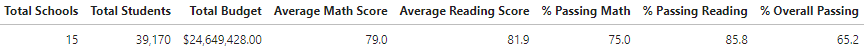

#### Revised
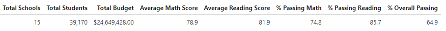

### By school

#### Original
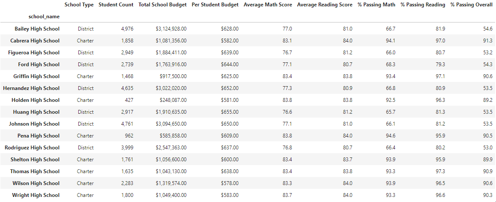

#### Revised
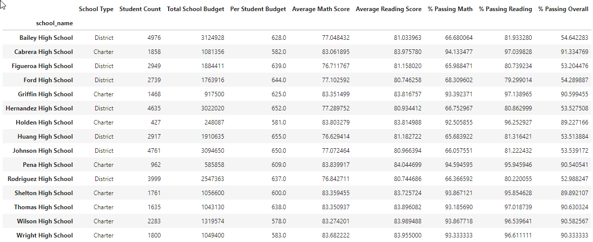

### Best performing schools

#### Original
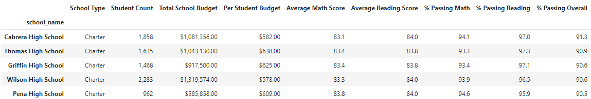

#### Revised
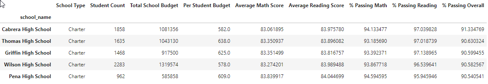

### Worst performing schools

#### Original
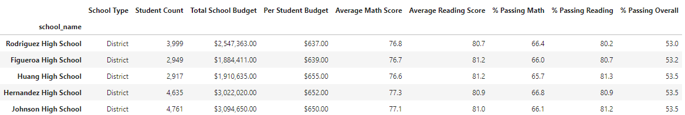

#### Revised
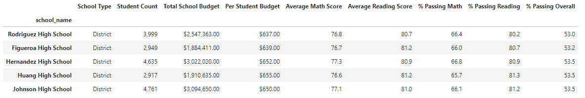

### Math scores by school/grade

#### Original
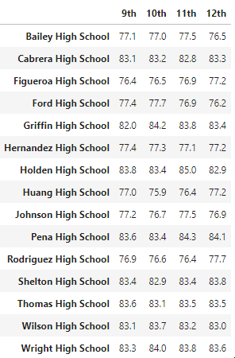

#### Revised
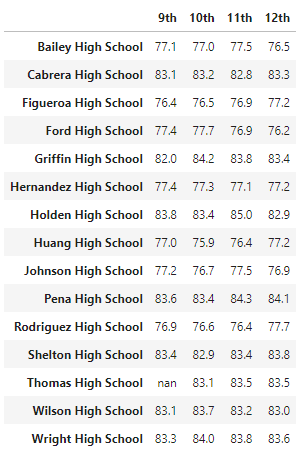

### Reading scores by school/grade

#### Original

#### Revised
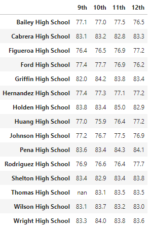

### By per-student budget expenditure

#### Original
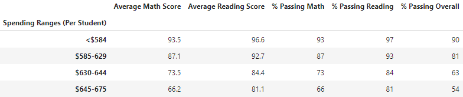

#### Revised
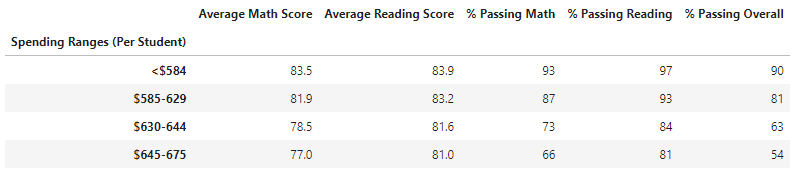

### By student body size

#### Original
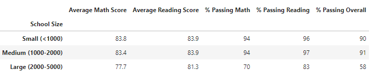

#### Revised
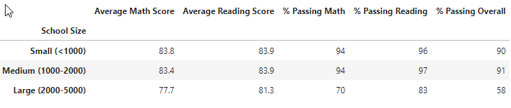

### By school type

#### Original
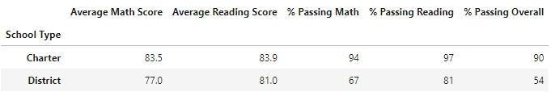

#### Revised
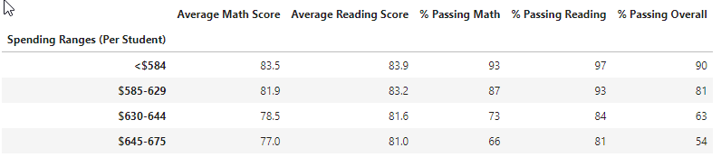

