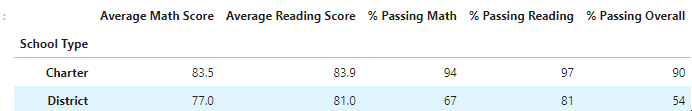

# Analysis of High School Standardized Test Data

## Project Overview

This repository contains analysis of standardized tests in both math and reading, adminstered to all high schoolers in a given school district.  The purpose of this analysis is to contextualize and drive budgetary decisions for the district in the coming school year.

School and student level data are analyzed and segmented by the following dimensions and groups:
* district-wide
* by school
* by school/grade
* by school type (charter vs district)
* by per-student budget expenditure
* by student body size

Two distinct versions of this analysis are contained in this repository:

* the initial analysis, conducted in [PyCitySchools.ipynb](PyCitySchools.ipynb)
* a secondary analysis, conducted in [PyCitySchools_Challenge.ipynb](PyCitySchools_Challenge.ipynb), altered the original script to remove compromise test data after a cheating scandal was identified in one specific school at one grade level.  This version was also refactored to streamline flow, adhere to coding best practices, and provide markdown comments where appropriate.

## Table of contents

1. [Resources](#resources)
2. [The Data](#data)
    * [Data cleanliness considerations](#cleanliness)
3. [Refactor](#refactor)
4. [Analysis](#analysis)
    * [General observations](#observations)
    * [Effect of cheating scandal on aggregates](#impact)
5. [Further analysis](#next_steps)
6. [Challenges](#challenges)
7. [Appendix](#appendix)

## Resources 

* Anaconda3 (2021.11)
* Jupyter Lab (3.2.1)
* Python (3.7.11)
    * Pandas module (1.3.4)
    * Numpy module (1.20.3)
* Visual Studio Code (1.63.2)

## The Data 

Source data is comprised of two files:
* `schools_complete.csv` contains data for each individual school including:
    * SchoolID
    * Name
    * Type
    * Size (student count)
    * Total budget

* `students_complete.csv` contains records for **39,170 student records**, each affiliated with one of the schools in the other csv.
    * Student ID
    * student_name
    * gender
    * grade level
    * school_name
    * reading_score
    * math_score

These two files were mapped together using the school's name, enabling us to conduct aggregation exercises for the test scores and grade levels.

### Data Cleanliness considerations 

Student names had to be scrubbed before the initial anlysis due to containing honorifics and professional titles, apparently a common joke among students in this district (e.g. "Mr. Eric Spoerner" or "Eric Spoerner Ph.D" instead of "Eric Spoerner").

Data was also subsequently re-calculated to factor in changes to remove 9th graders at Thomas from the sample set.  A widespread cheating scandal was identified among this group, rendering that component of the dataset unreliable.  All scores belonging to this group were removed from the data set, and excluded from aggregate numbers when calculating grade- and school-level aggregate values.

## Code refactor 

As part of the work on altering the analysis to exclude Thomas High 9th graders, a larger code refactor was undertaken from PyCitySchools.ipynb to PyCitySchools_challenge.ipynb.  This refactor:

* eliminated unnecessary print statements and other debug statements in favor of streamlined code that only calls final output dataframes
* renamed data objects for legibility, including appending `_df` to all primary DataFrame objects 
* Added markdown cells to document major components
* Addressed formatting challenge (see [Challenges](#challenges) below)

## Analysis 

All data tables used an analysis are referenced below in the [Appendix](#appendix), and are accessed by clicking the link for each listed category where provided.

### General observations 

* Current budget is inversely correlated with standardized test performance.
* Top and bottom 5 schools are illustrative of the disparity between charter and district schools -- all of the top 5 schools have a > 90% overall passing rate and are all charter, while the bottom 5 schools all have a < 55% overall passing rate and are all district schools. 
* Overall student body performs far better on reading (passing rate 85.7%) than math (passing rate 74.8%).  Given that average scores for each category are much closer (81.9 reading, 78.9 math), this suggests varying distributions of test score results for math as opposed to reading.
* Similarly, the discrepancy in average score for charter vs district is far lower than discrepancy in passing percentage.  Suggests a significant volume of troubled or highly remedial students in district schools.
* No apparent trends or significant fluctuation are noticeable on a grade-by-grade basis.

### Effect of removal of compromised data on analysis 

The following is a list the changes to calculation results resulting from removal of Thomas High 9th graders:

* [District summary](#district):
    * Average math score drops from 79.0 to 78.9, but average reading score remains 81.9.
    * Percentage passing math drops from 75% to 74.8%.
    * Percentage passing reading drops from 85.8% to 85.7%.
    * Overall passage rate drops from 65.2% to 64.9%.
* [School Summary](#perschool):
    * Thomas High average reading score rises from 83.8 to 83.9, while math stays steady at 83.4.
    * Thomas High percentage passing math drops from 93.3% to 93.2%.
    * Thomas High percentage passing reading drops from 97.3% to 97.2%.
    * Thomas High overall passage rate drops from 90.9% to 90.6%
* [Top 5 schools](#top_five):
    * Thomas High's reduced overall passage rate drops it from uncontested #2 ranked school in the district (90.9% passing), to a tie with Griffin High School, which also has a 90.6% overall passing rate.
* [Math](#math) and [reading](#reading) scores by grade:
    * Because the cheating scandal was contained in one grade level at one school, the only difference in this analysis is the missing values for Thomas High 9th graders (listed in the tables below as "nan", which stands for "not a number".)
* The following categories had negligible effect based on calculation methodology and significant figures in output:
    * [Scores by school spending](#budget)
    * [Scores by school size](#size)
    * [Scores by school type](#type)

## Further analysis 

* _Refine average calculations_.  Several statistics in this model including scores by school spending, size, and type, were calculated using an "average of averages" methodology, wherein student data was first aggregated at the school level, and then those school-based averages were averaged together.  This is a fairly unsophisticated aggregation model, and complicated the analysis of the impact of omitting Thomas High's 9th grade test scores.

* _Gender-based analysis_. Consider further segmentation of test results by gender to identify potential areas of high gender discrepancy, especially in specific schools or school types.

* _Further statistical analysis_ - Find distributions and outliers in all of the categories that have thus far been calaculated.  Identify potential inequalities of student outcome in data set that are not identified through this analysis.

## Challenges 

In the current data flow of the model, the primary DataFrame for retaining school summary data is calculated, and then subsequently the same column is formatted to display dollar signs, separator commas, and appropriate significant figures.  This conversion results in columns with modified data types (`Float64` -> `Object`), rendering them unable to be referenced for subsequent analysis.  In this case, those numbers were still needed for subsequent aggregations on school type, budget, and size.

Two options were considered to handle this during the refactor:
1. Migrate pre-calculated results to a new "raw" column value on the DataFrame, retaining them for subsequent calculations when needed and omitting them from visual presentation
2. Only conduct formatting at the very end of the analysis after all calculations are complete

Option 1 was chosen, as this was the path that was least disruptive to data flow.

## Appendix 

### District aggregation 

#### Original

#### Revised

### By school 

#### Original

#### Revised

### Best performing schools 

#### Original

#### Revised

### Worst performing schools 

#### Original

#### Revised

### Math scores by school/grade 

#### Original

#### Revised

### Reading scores by school/grade 

#### Original

#### Revised

### By per-student budget expenditure 

#### Original

#### Revised

### By student body size 

#### Original

#### Revised

### By school type 

#### Original

#### Revised

