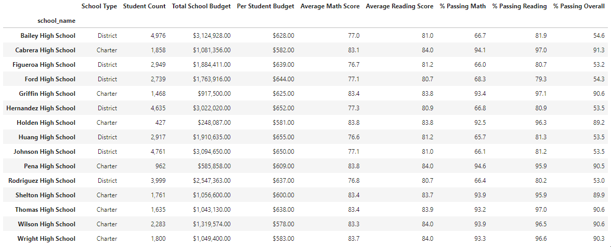
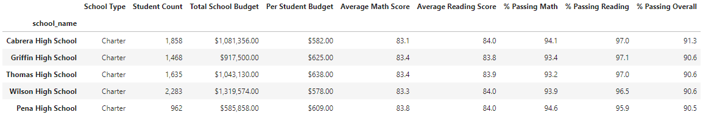
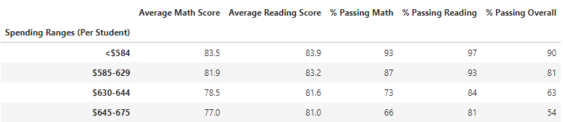
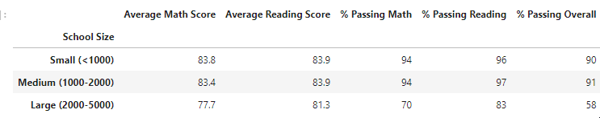

# Analysis of High School Standardized Test Data

## Project Overview

Presentation to state board of education. Standardized tests in math and science.  Proficiency of performance metrics by school.  Segment by multiple levels:
dist,school,grade,schooltype, budget.

Budget is included and the purpose of this analysis is to calculate budgetary consideraations.

Two copies of this analysis are contained:
* the initial analysis; `name of original file`
* a secondary analysis `name of second file` conducted to remove flawed test data after a cheating scandal was identified in one specific school at one grade level.. analysis was altered to remove all traces of that grade leverl.

## Table of contents

1. [Resources](#resources)
2. [The Data](#data)
    * Data cleanliness considerations
3. [Analysis](#analysis)
    * General observations
    * Effect of cheating scandal on aggregates
4. [Refactor](#refactor)
7. [Challenges](#challenges)
8. [Further analysis](#nextsteps)
9. [Appendix](#appendix)

## Resources 

* jupyter lab (version)
    * Python (version)
    * pandas, os, numpy modules
* VS code

## The Data 

Two csv files:
* `schools_complete.csv` contains data for each individua lschool including:
    * SchoolID
    * Name
    * Type
    * Size (student count)
    * Total budget

* `students_complete.csv` contains records for **39,170 student records**, each affiliated with one of the schools in the other csv.
    * Student ID
    * student_name
    * gender
    * grade level
    * school_name
    * reading_score
    * math_score

These two files can be mapped together using the school's name, enabling us to conduct aggregation exercises for the test scores and grade levels.

### Data Cleanliness considerations

Data had to be scrubbed before the initial anlysis due to containing honorifics and professional titles, apparently a common gag among students in this district.

Data was subsequently re-calculated to factor in changes to remove 9th graders at Thomas from the sample set.

## Code refactor 

As part of the work on altering the analysis to exclude Thomas High 9th graders, a larger code refactor was undertaken.

Eliminated unecessary print statements and other debug statements in initial analysis for diagnostic purposes and replaced them with more streamlined purpose-driven cells for simplicity and legibility.

Added markdown cells to better document flow of analysis.

Renamed data frames and other artifacts for legibility.

## Analysis 

### General observations
Current budget is inversely correlated with actual performance.  (How does this analysis compare with charter v district discussion?)

### Effect of cheating scandal on aggregates

All data tables used an anaysis are referenced below in the [Appendix](#appendix), and are accessed by clicking the link for each listed category.

* [District summary](#district):
    * Average math score drops from 79.0 to 78.9, but average reading score remains 81.9.
    * Percent passing math drops from 75% to 74.8%.
    * Percentage passing reading drops from 85.8% to 85.7%.
    * Overall passage rate drops from 65.2% to 64.9%
* [School Summary](#perschool):
    * Thomas High average reading score rises from 83.8 to 83.9, while math stays steady at 83.4.
    * Percent passing math drops from 93.3% to 93.2%.
    * Percentage passing reading drops from 97.3% to 97.2%.
    * Overall passage rate drops from 90.9% to 90.6%
* [Top 5 schools](#top_five):
    * Thomas High's reduced overall passage rate drops it from uncontested #2 ranked school in the district, to a tie with Griffin High School, which also has a 90.6% overall passing rate.
* [Math](#math) and [reading](#reading) scores by grade:
    * Because the cheating scandal was contained in one grade level at one school, the only difference in this analysis is the missing values for Thomas High 9th graders (listed in the tables below as "nan", which stands for "not a number".)
* The following categories had negligible effect based on calculation methodology and significant figures in output:
    * [Scores by school spending](#budget)
    * [Scores by school size](#size)
    * [Scores by school type](#type)

## Challenges 

Formatting was a significant concern.  In particular, the ability to retain a formatted column before more analysis needed to be conducted.

## Further analysis 

## Appendix 

### District aggregation 

#### Original

#### Revised

### By school 

#### Original

#### Revised

### Best performing schools 

#### Original

#### Revised

### Worst performing schools 

#### Original

#### Revised

### Math scores by school/grade 

#### Original

#### Revised

### Reading scores by school/grade 

#### Original

#### Revised

### By per-student budget expenditure 

#### Original

#### Revised

### By student body size 

#### Original

#### Revised

### By school type 

#### Original

#### Revised

